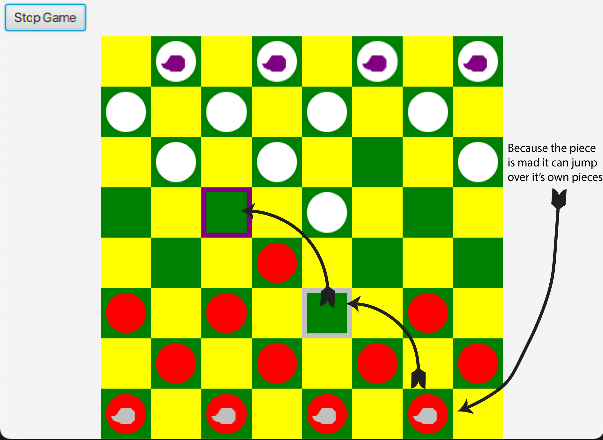

# Lab 04

### Due: Week 4 Sunday, 5pm

### Value: 2% of course mark

## Aims

* Apply the strategy and state patterns

## Setup

An individual repository for you for this lab has been created for you on the CSE GitLab server. You can find it at this URL (substituting z5555555 for your own zID):

[https://gitlab.cse.unsw.edu.au/COMP2511/21T2/students/z5555555/21T2-cs2511-lab04](https://gitlab.cse.unsw.edu.au/COMP2511/21T2/students/z5555555/21T2-cs2511-lab04)

**REMEMBER** to replace the zID below with your own.

`git clone gitlab@gitlab.cse.unsw.EDU.AU:COMP2511/21T2/students/z555555/21T2-cs2511-lab04.git`

## Lab 04 - Exercise - The State of Quaint 🦆

Quaint, as explained in the tutorial, is a paint application that has the following requirements;

- The ability to draw shapes such as rectangles and ovals, you should be able to give shapes constant aspect ratios by holding shift while dragging
- The ability to select a region then perform operations on it, regions are selected via a box
  - You can delete a region with ctrl + d
  - You can paste a region with ctrl + v, this won't clear the old region and will just paste it (i.e. copy + paste)
- The ability to paint using a brush like tool
- The ability to remove mistakes
- The ability to save my picture out to a location of my choosing
- The ability to load an image onto the canvas by clicking the image load tool, selecting the image you want to insert, then clicking where you want to insert it.
  - After placing the image it should return to just the simple cursor.
- The ability to change colours using a colour wheel for the strokes and shapes
- A new pipette tool that appears next to the colour selector that lets you pick the stroke/fill colour based upon the canvas.

More specifically, we can build the various states 'selecting region', 'drawing', 'dragging', and so on as various different states.  Specifically the states are as follows;

State Table Descriptions

<table>
<th>
State
</th>
<th>
Description
</th>
<tr>
<td>
SimpleState
</td>
<td>
Just a normal cursor state, x + y position is shown above the mouse cursor
</td>
</tr>

<tr>
<td>
PaintingState
</td>
<td>

A drawing tool was chosen such as freehand that has no drag enabled i.e. 'painting'
  - `Esc` => SimpleState
  - Pressing `Secondary Mouse Button` : Toggles between eraser tool and painting tool.

</td>
</tr>

<tr>
<td>
CanvasActionState
</td>
<td>

A specialised drawing state that ends after a single 'action' i.e. placing an image or taking a colour from the canvas
  - `Esc` => SimpleState
  - Pressing `Primary Mouse Button` : Triggers action => SimpleState

</td>
</tr>

<tr>
<td>
ShapeState
</td>
<td>

ShapeState : A drawing tool was chosen that enabled dragging over a region to define a shape.
  - `Esc` => SimpleState
  - `Primary Mouse Button` => DraggingState
  - `Shift` + `Primary Mouse Button` => ConstantAspectRatioDraggingState

</td>
</tr>

<tr>
<td>
DraggingState
</td>
<td>

Represents a dragging operation with an action to perform after the drag has finished
  - `Shift` => ConstantAspectRatioDraggingState
  - `Esc` => SimpleState
  - If tool = box-select and `Primary Mouse Button` released => SelectionState else => prior ShapeState

</td>
</tr>

<tr>
<td>
DraggingState
</td>
<td>

Represents a dragging operation with an action to perform after the drag has finished
  - `Shift` => ConstantAspectRatioDraggingState
  - `Esc` => SimpleState
  - If tool = box-select and `Primary Mouse Button` released => SelectionState else => prior ShapeState

</td>
</tr>

<tr>
<td>
ConstantAspectRatioDraggingState
</td>
<td>

Represents a dragging operation where width = height = min(width, height)
  - Abscense of `Shift` (i.e. no longer holding the key down) => DraggingState
  - `Esc` => SimpleState
  - If tool = box-select and `Primary Mouse Button` released => SelectionState

</td>
</tr>

<tr>
<td>
SelectionState
</td>
<td>

A region has been selected and you can move that region around by clicking on it and dragging it around.
  - Clicking outside selection => State prior to this operation (i.e. ShapeState for box-select)
    - Will clear all copy/cut history
  - `Ctrl` + `d` : Clear out selection => State prior to this operation (i.e. ShapeState for box-select)
  - `Ctrl` + `c` : Copy the region
  - `Ctrl` + `x` : Mark region as cut, should not be cleared until region is pasted
  - `Ctrl` + `v` If copied or cut : Paste region (clearing selected region if marked as copied) => SelectionState for new region (forget old region)

</td>
</tr>

</table>

> For simplicity the SimpleState `Esc` is implemented within the CanvasController and is external to the State Machine, you should still include it in your table / diagram.

### Task

Fill out a State Table to represent the state transitions in this system.  You'll notice that it only includes *some* of the states, we are only modelling the SelectionState, Dragging States, and Shape State / SimpleState the other states are unaffected.

* Alternatively, you can create a State Table (see [Slide 8 of the lecture slides on the State Pattern](https://webcms3.cse.unsw.edu.au/COMP2511/21T2/resources/61426)). 

To help you start the following image shows just a small section of the below requirements modelled as a State Diagram.  This is just to help you see how the system interacts


## Lab 04 - Exercise - The Crown's Gambit - Strategy Pattern 👑

For this exercise,  you need to refactor the code provided that already implements the following game "The Crown's Gambit". Please note that you need to use the Strategy pattern in your refactoring. In order to properly refactor your code, you need to first understand the rules of this interesting game, which are provided below. Considering the game is already implemented, in most of the cases you simply need to copy/paste the code. However, this exercise will demonstrate how you can improve your design by using a very useful Strategy Pattern. 

Checkers is a classic game with some relatively simple rules.


It's a 2 player game, in our version the pieces are red and white to represent the two different players.  Red goes first.

Each player takes their turn by moving a single piece diagonally forwards (towards the opponent) to the next dark square.

If there is a piece diagonally adjacent to one of your checkers you can 'jump' over that piece to the empty square on the other side.  You can only jump over enemy pieces.
  - If there isn't an empty square (i.e. 2 of red's pieces are placed diagonally adjacent) then you can't jump over both of them at the same time, capturing the piece
  - However, you can perform multiple jumps in a single turn given that there is an empty space between each piece.


Note: That making a 'silver' move still ends your turn, the system will handle the multiple sequential jumps if you click on one of the purple squares that 'branches' off from it.

If a piece makes it all the way to the end it 'crowns' gaining a unique symbol and the ability to move in both directions (forwards and backwards).

A player loses once they no longer have any more checkers available.

There are is a single options that is configurable upon defining a new game, there is already a checkbox in the start game screen to represent this.

- `Quackering` if this is set then every piece in the back row for both players goes mad, mad pieces are signified by a special symbol (as shown below) and *can* jump over your own pieces.  If your own piece gets jumped it doesn't get captured and instead just goes mad.  Crowned pieces can go mad (and mad pieces can get crowned).



Your task is to refactor the code such that it uses the strategy pattern to implement both the rendering of the checkers (i.e. the drawing of the circles) as well as the logic for which positions are valid.

Hints:

- Look at the unused interface `CheckerStrategy`.
- A checker piece could have multiple strategies that it aggregates.
- You don't have to write *ANY* JavaFX code here, you'll want to grab the code that renders the checkers and move it around but you won't have to change it.
- Don't worry about the recursion of multiple jumps, the CheckerController handles this by checking if any of the valid positions can be used to jump again.  Just focus on the jumps you can make from a given position.

## Installing JavaFX on your own system

Delete the *symlink_javafx* symbolic link, then download and unzip the latest version of the JavaFX JDK for Java 11 for your Operating System (taking into account if you have a 64 or 32 bit machine), and transfer the contents of the *lib* folder inside the JDK download into the *lib* folder on your cloned repository. You will also need to change the [*launch.json*](.vscode/launch.json) file to refer to **"./lib"** instead of **./lib/symlink_javafx** in the *"vmArgs"* configuration (note these modifications were tested on Windows 10) as per below;

```diff
{
    // Use IntelliSense to learn about possible attributes.
    // Hover to view descriptions of existing attributes.
    // For more information, visit: https://go.microsoft.com/fwlink/?linkid=830387
    // NOTE - we turn assertions on to help debugging, although they shouldn't be used in production code
    "version": "0.2.0",
    "cwd": "${workspaceRoot}",
    "configurations": [
        {
            "type": "java",
            "name": "CodeLens (Launch) - LoopManiaApplication",
            "request": "launch",
-           "vmArgs": "--module-path ./lib/symlink_javafx --add-modules javafx.controls,javafx.fxml -enableassertions",
+           "vmArgs": "--module-path ./lib --add-modules javafx.controls,javafx.fxml -enableassertions",
            "mainClass": "unsw.loopmania.LoopManiaApplication"
        }
    ]
}
```

You may also need to copy the contents of the *bin* folder in the unzipped JavaFX JDK download into a *bin* folder under the root directory of your cloned repository (e.g. for Windows).

The following version of the JavaFX JDK is recommended if you choose to run it on your computer, since it is the same version as on the CSE machine:

https://gluonhq.com/products/javafx/

Note that if you deviate from this precise directory structure, you may need to modify the VSCode configuration in [*launch.json*](.vscode/launch.json) to be able to run the game in VSCode.

If these steps worked (and you setup java, and the recommended VSCode extensions properly), you should be able to run the starter code game.

## Submission

To submit, make a tag to show that your code at the current commit is ready for your submission using the command:

```bash
$ git tag -fa submission -m "Submission for Lab-04"
$ git push -f origin submission
```

Or, you can create one via the GitLab website by going to **Repository > Tags > New Tag**. 

We will take the last commit on your `master` branch before the deadline for your submission.
