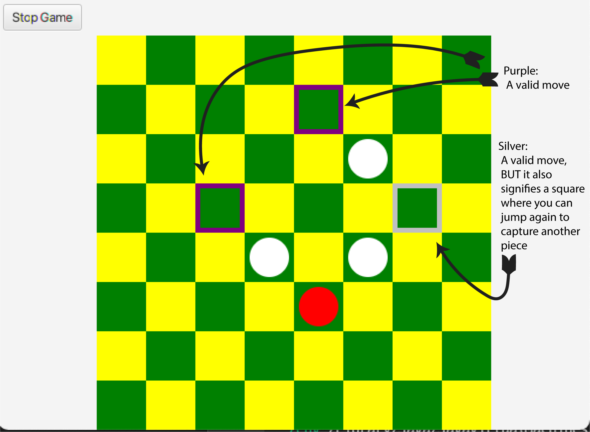

# Lab 04

### Due: Week 4 Sunday, 5pm

### Value: 2% of course mark

## Aims

* Apply the strategy and state patterns

## Setup

An individual repository for you for this lab has been created for you on the CSE GitLab server. You can find it at this URL (substituting z5555555 for your own zID):

[https://gitlab.cse.unsw.edu.au/COMP2511/21T2/students/z5555555/21T2-cs2511-lab04](https://gitlab.cse.unsw.edu.au/COMP2511/21T2/students/z5555555/21T2-cs2511-lab04)

**REMEMBER** to replace the zID below with your own.

`git clone gitlab@gitlab.cse.unsw.EDU.AU:COMP2511/21T2/students/z555555/21T2-cs2511-lab04.git`

## Lab 04 - Exercise - The State of Quaint 🦆

Quaint, as explained in the tutorial, is a paint application that has the following requirements;

- The ability to 'freehand' draw on a canvas
- The ability to draw rectangles by dragging out a region using my mouse
- The ability to draw ovals by selecting a start point then dragging out to expand the radius
- Hold shift to cause ovals & rectangles to have a 1:1 aspect ratio i.e. width = height (i.e. squares & circles)
- The ability to use a square eraser to remove mistakes
- The ability to change colours using a colour wheel for the stroke freehand, ovals, rectangles
- The ability to change stroke width between 10 and 100 pixels
- The ability to select an optional fill colour for rectangles and ovals
- The ability to scroll to change the stroke width
- The ability to save my picture out as a png to a location of my choosing
- The ability to select a region then perform operations on it, regions are selected via a box
  - You can delete a region with ctrl + d
  - You can paste a region with ctrl + v, this won't clear the old region and will just paste a new region that is already selected at the cursor.
- The ability to load an image onto the canvas by clicking the image load tool, selecting the image you want to insert, then clicking where you want to insert it.
  - After placing the image it should return to just the simple cursor.
  - Scrolling should change how big the image being placed is scaled.

More specifically, we can build the various states 'selecting region', 'drawing', 'dragging', and so on as various different states.  Specifically the states are as follows;

> In reality, you would probably implement some of these states as just booleans (i.e. ConstantAspectRatio) if they truly are that simple.

### Task

Create a State Diagram **or** a State Table to represent the state transitions in this system. 

If you need to brush up on State Diagrams, here is a [COMP1531 Lecture covering the material](https://youtu.be/ZJu5P9KlCn0?t=70).

Alternatively, you can create a State Table (see [Slide 8 of the lecture slides on the State Pattern](https://webcms3.cse.unsw.edu.au/COMP2511/21T2/resources/61426)). 

To help you start the following image shows just a small section of the below requirements modelled as a State Diagram. You will need to extend on this to incorporate the other requirements.


State Table Descriptions

<table>
<th>
<td>
State
</td>
<td>
Description
</td>
</th>
<tr>
<td>
SimpleState
</td>
<td>
Just a normal cursor state, x + y position is shown above the mouse cursor
</td>
</tr>

<tr>
<td>
PaintingState
</td>
<td>

A drawing tool was chosen such as freehand that has no drag enabled i.e. 'painting'
  - `Esc` => SimpleState
  - Pressing `Secondary Mouse Button` : Toggles between eraser tool and painting tool.

</td>
</tr>

<tr>
<td>
CanvasActionState
</td>
<td>

A specialised drawing state that ends after a single 'action' i.e. placing an image or taking a colour from the canvas
  - `Esc` => SimpleState
  - Pressing `Primary Mouse Button` : Triggers action => SimpleState

</td>
</tr>

<tr>
<td>
ShapeState
</td>
<td>

ShapeState : A drawing tool was chosen that enabled dragging over a region to define a shape.
  - `Esc` => SimpleState
  - `Primary Mouse Button` => DraggingState
  - `Shift` + `Primary Mouse Button` => ConstantAspectRatioDraggingState

</td>
</tr>

<tr>
<td>
DraggingState
</td>
<td>

Represents a dragging operation with an action to perform after the drag has finished
  - `Shift` => ConstantAspectRatioDraggingState
  - `Esc` => SimpleState
  - If tool = box-select and `Primary Mouse Button` released => SelectionState

</td>
</tr>

<tr>
<td>
DraggingState
</td>
<td>

Represents a dragging operation with an action to perform after the drag has finished
  - `Shift` => ConstantAspectRatioDraggingState
  - `Esc` => SimpleState
  - If tool = box-select and `Primary Mouse Button` released => SelectionState

</td>
</tr>

<tr>
<td>
ConstantAspectRatioDraggingState
</td>
<td>

Represents a dragging operation where width = height = min(width, height)
  - Abscense of `Shift` (i.e. no longer holding the key down) => DraggingState
  - `Esc` => SimpleState
  - If tool = box-select and `Primary Mouse Button` released => SelectionState

</td>
</tr>

<tr>
<td>
SelectionState
</td>
<td>

A region has been selected and you can move that region around by clicking on it and dragging it around.
  - Clicking outside selection => State prior to this operation (i.e. ShapeState for box-select)
    - Will clear all copy/cut history
  - `Ctrl` + `d` : Clear out selection => State prior to this operation (i.e. ShapeState for box-select)
  - `Ctrl` + `c` : Copy the region
  - `Ctrl` + `x` : Mark region as cut, should not be cleared until region is pasted
  - `Ctrl` + `v` If copied or cut : Paste region (clearing selected region if marked as copied) => SelectionState for new region (forget old region)

</td>
</tr>

</table>

> For simplicity the SimpleState `Esc` is implemented within the CanvasController and is external to the State Machine, you should still include it in your table / diagram.

## Lab 04 - Exercise - The Crown's Gambit - Strategy Pattern 👑

Checkers is a classic game with some relatively simple rules.  An example board looks like below


It's a 2 player game, in our version the pieces are red and white to represent the two different players.  Red goes first.

Each player takes their turn by moving a single piece diagonally forwards (towards the opponent) to the next dark square.

If there is a piece diagonally adjacent to one of your checkers you can 'jump' over that piece to the empty square on the other side.
  - If there isn't an empty square (i.e. 2 of red's pieces are placed diagonally adjacent) then you can't jump over both of them at the same time, capturing the piece
  - However, you can perform multiple jumps in a single turn given that there is an empty space between each piece.



Purple denotes possible finishing positions, silver marks squares that have another attached capture.  If you click on a silver square it will end your turn still, you'll want to click on the branching purple position to chain jumps.

If a piece makes it all the way to the end it 'crowns' gaining a unique symbol and the ability to move in both directions (forwards and backwards).

A player loses once they no longer have any more checkers available.

There are a few additional 'options' that are configurable upon defining a new game, there are already checkboxes in the start game screen to represent this.

- `Force Capture` if this is set then the player should be forced to take a capture if it's available.
- `The Quackering` randomly causes half the pieces to develop madness... where they can jump over 2 pieces which are placed diagonally sequential (as per the image below) BUT they can't chain jumps and still require an empty space after the 2 pieces.  Checker.java already has some code to render Checkers that are marked as `mad = true`.

Your task is to refactor the code such that it uses the strategy pattern to implement both the rendering of the checkers (i.e. the drawing of the circles) as well as the logic for which positions are valid.

Hints:

- Look at the unused interface `CheckerStrategy`.
- A checker piece could have multiple strategies that it aggregates.
- You don't have to write *ANY* JavaFX code here, you'll want to grab the code that renders the checkers and move it around but you won't have to change it.
- How are you going to handle force jump?
- Don't worry about the recursion of multiple jumps, the CheckerController handles this by checking if any of the valid positions can be used to jump again.
- `forceJump.isSelected()` (and similar for quackering) can be used to determine if the checkbox is ticked.

## Installing JavaFX on your own system

Delete the *symlink_javafx* symbolic link, then download and unzip the latest version of the JavaFX JDK for Java 11 for your Operating System (taking into account if you have a 64 or 32 bit machine), and transfer the contents of the *lib* folder inside the JDK download into the *lib* folder on your cloned repository. You will also need to change the [*launch.json*](.vscode/launch.json) file to refer to **"./lib"** instead of **./lib/symlink_javafx** in the *"vmArgs"* configuration (note these modifications were tested on Windows 10) as per below;

```diff
{
    // Use IntelliSense to learn about possible attributes.
    // Hover to view descriptions of existing attributes.
    // For more information, visit: https://go.microsoft.com/fwlink/?linkid=830387
    // NOTE - we turn assertions on to help debugging, although they shouldn't be used in production code
    "version": "0.2.0",
    "cwd": "${workspaceRoot}",
    "configurations": [
        {
            "type": "java",
            "name": "CodeLens (Launch) - LoopManiaApplication",
            "request": "launch",
-           "vmArgs": "--module-path ./lib/symlink_javafx --add-modules javafx.controls,javafx.fxml -enableassertions",
+           "vmArgs": "--module-path ./lib --add-modules javafx.controls,javafx.fxml -enableassertions",
            "mainClass": "unsw.loopmania.LoopManiaApplication"
        }
    ]
}
```

You may also need to copy the contents of the *bin* folder in the unzipped JavaFX JDK download into a *bin* folder under the root directory of your cloned repository (e.g. for Windows).

The following version of the JavaFX JDK is recommended if you choose to run it on your computer, since it is the same version as on the CSE machine:

https://gluonhq.com/products/javafx/

Note that if you deviate from this precise directory structure, you may need to modify the VSCode configuration in [*launch.json*](.vscode/launch.json) to be able to run the game in VSCode.

If these steps worked (and you setup java, and the recommended VSCode extensions properly), you should be able to run the starter code game.

## Submission

To submit, make a tag to show that your code at the current commit is ready for your submission using the command:

```bash
$ git tag -fa submission -m "Submission for Lab-04"
$ git push -f origin submission
```

Or, you can create one via the GitLab website by going to **Repository > Tags > New Tag**. 

We will take the last commit on your `master` branch before the deadline for your submission.
